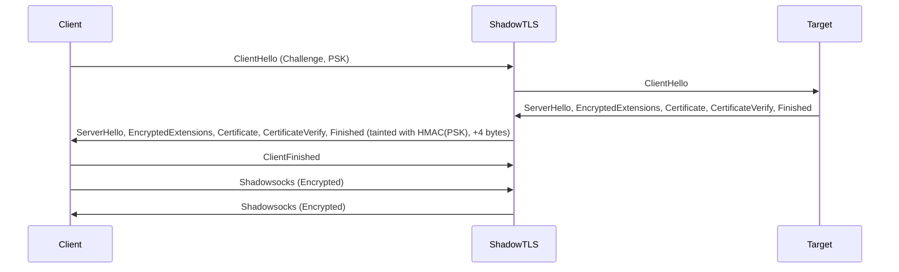
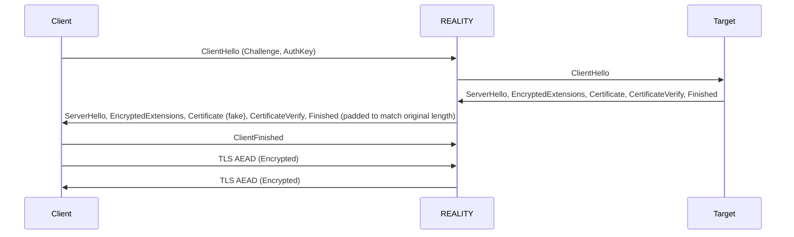
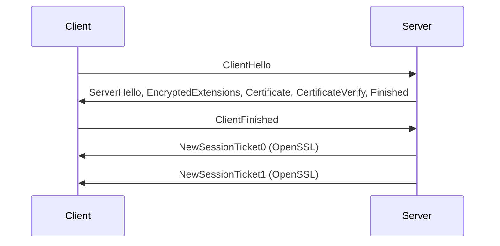
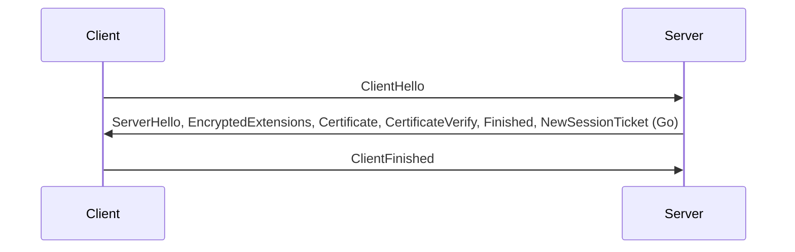

# Aparecium

Aparecium is a proof-of-concept tool designed to detect TLS camouflage protocols, specifically [ShadowTLS v3](https://github.com/ihciah/shadow-tls) and [REALITY](https://github.com/XTLS/REALITY), by exploiting their handling of TLS 1.3 post-handshake messages.

## Overview

**ShadowTLS v3** and **REALITY** are TLS 1.3-based camouflage protocols that disguise network traffic as legitimate TLS traffic to evade deep packet inspection (DPI) and active probing. Aparecium identifies these protocols by analyzing discrepancies in post-handshake messages, particularly the `NewSessionTicket` message, which these protocols fail to mimic correctly.

## TLS Camouflage Protocols

### ShadowTLS v3
ShadowTLS v3 uses **Pre-Shared Key (PSK)** authentication and relays second-pass handshake messages (e.g., `ServerHello`, `EncryptedExtensions`, `Certificate`, `CertificateVerify`, `Finished`) from the target server, tainting them with an **HMAC(PSK)** that adds **4 bytes** to their length. After the client sends the `ClientFinished` message, ShadowTLS stops relaying target server messages and handles encrypted Shadowsocks traffic.



### REALITY
REALITY operates as a "real" TLS 1.3 server, generating a **fake Certificate** message and padding responses to match the target server’s message lengths. Like ShadowTLS, it only relays second-pass handshake messages and switches to encrypted TLS AEAD traffic after the `ClientFinished` message.



## Exploitation

Aparecium exploits a key vulnerability: both protocols fail to handle **post-handshake messages**, specifically the `NewSessionTicket` message, as defined in the [TLS 1.3 RFC](https://datatracker.ietf.org/doc/html/rfc8446#section-4.6.1). In standard TLS 1.3, servers normally (e.g., those using OpenSSL) send one or two `NewSessionTicket` messages after receiving the `ClientFinished` message. ShadowTLS and REALITY do not relay or mimic these messages correctly, especially when mimicking OpenSSL-based servers.

### TLS 1.3 Post-Handshake Behavior
- **OpenSSL-based servers** (common in Nginx, Apache) send [two](https://github.com/openssl/openssl/blob/f426dd1311eecd12f24190c94f56eb85e62aaa27/ssl/ssl_lib.c#L4244) `NewSessionTicket` messages [after](https://github.com/openssl/openssl/blob/f426dd1311eecd12f24190c94f56eb85e62aaa27/ssl/statem/statem_srvr.c#L579) `ClientFinished`.

- **Go-based servers** send one `NewSessionTicket` message before `ClientFinished`, which ShadowTLS and REALITY relay since it occurs earlier.


Since most web servers (e.g., Nginx, Apache) use OpenSSL, ShadowTLS and REALITY fail to mimic their post-handshake behavior, discarding `NewSessionTicket` messages.

### Detection Method
Aparecium detects TLS camouflage protocols in two phases:

#### Phase 1: ClientHello Fingerprinting
1. Capture a `ClientHello` message and generate its fingerprint using [utls.Fingerprinter](https://pkg.go.dev/github.com/refraction-networking/utls#Fingerprinter).
2. Replay a modified `ClientHello` (with new `ClientRandom`, `SessionID`, and `KeyShare`) to the suspected server.
3. Complete the TLS handshake and send a probe request based on the negotiated application protocol (e.g., HTTP).
4. Record the lengths of any `NewSessionTicket` messages (typically two equal-length messages for OpenSSL servers).
5. If no NewSessionTicket messages are received, the server is likely a legitimate TLS server.

#### Phase 2: NewSessionTicket Analysis
1. Monitor the server’s response after the `ServerFinished` message (fixed at 53 or 69 bytes in TLS 1.3).
2. Check the lengths of the next two messages:
   - If they do not match the `NewSessionTicket` lengths from Phase 1, the server is likely using a TLS camouflage protocol.
   - If the lengths match, the server is likely a legitimate TLS server.
3. For ShadowTLS, verify if the `ServerFinished` message is 4 bytes longer (57 or 73 bytes) due to HMAC(PSK) tainting.

### Exception
Some servers, like those operated by [Google](https://www.google.com), do not send `NewSessionTicket` messages. When ShadowTLS or REALITY mimics these servers, they are immune to this detection method, as described in Phase 1.5.

## Installation

### Prerequisites
- [sing-box](https://github.com/SagerNet/sing-box)
- [Xray-core](https://github.com/XTLS/Xray-core)
- [curl](https://curl.se/)
- [Go 1.24.x](https://go.dev/dl/)

### Setup
1. Clone the Aparecium repository:
   ```bash
   git clone https://github.com/ban6cat6/aparecium.git
   cd aparecium
   ```
2. Install dependencies:
   ```bash
   go mod tidy
   ```

## Usage

### Running the Tool
1. Start the proxy server and client with the appropriate configuration files for ShadowTLS or REALITY:
   ```bash
   $SERVER run -c $PROTOCOL/client.json
   $SERVER run -c $PROTOCOL/server.json
   ```
2. Launch Aparecium to intercept traffic between the proxy client and server:
   ```bash
   go run ./main.go
   ```

### Probing the Server
Probe the server at `127.0.0.1:10444` using a TLS client, such as `curl`:
```bash
curl -vik --resolve wechat.com:10444:127.0.0.1 https://wechat.com:10444
```

Alternatively, use this Go code snippet:
```go
package main

import (
    "crypto/tls"
    "net"
)

func main() {
    conn, err := net.Dial("tcp", "127.0.0.1:10444")
    if err != nil {
        panic(err)
    }
    tlsConn := tls.Client(conn, &tls.Config{
        ServerName: "wechat.com",
    })
    err = tlsConn.Handshake()
    if err != nil {
        panic(err)
    }
}
```

The TLS handshake should complete without errors.

### Verifying Detection
Send a request through a SOCKS5 proxy to verify detection:
```bash
curl -x socks5://127.0.0.1:10080 http://www.example.com
```

If a TLS camouflage protocol is detected, Aparecium will output:
```
TLS camouflage connection detected
```

## Mitigation

### For REALITY
To resist detection, REALITY servers should mimic OpenSSL-based servers:
1. Delay sending `NewSessionTicket` messages until after receiving the `ClientFinished` message.
2. Actively probe the target server to capture `NewSessionTicket` message lengths.
3. Send fake, padded `NewSessionTicket` messages matching the target’s lengths.

### For ShadowTLS
The HMAC(PSK) tainting in ShadowTLS adds 4 bytes to handshake messages, making it highly detectable. To mitigate:
- Remove or modify the HMAC mechanism to avoid length discrepancies.
- Mimic OpenSSL’s post-handshake behavior by sending fake `NewSessionTicket` messages after `ClientFinished`.

ShadowTLS v3 is hereby declared "dead" due to its inherent design flaws. The HMAC(PSK) tainting adds 4 bytes to handshake messages (e.g., ServerFinished, resulting in 57 or 73 bytes instead of the standard 53 or 69 bytes), creating a glaring signature that tools like Aparecium easily detect.

## Contributing
Contributions are welcome! Please submit a pull request or open an issue on the [GitHub repository](https://github.com/ban6cat6/aparecium).

## License
This project is licensed under the [MIT License](LICENSE).